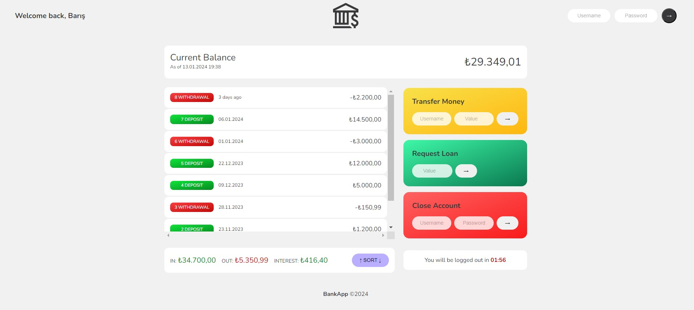

# BankApp

## You can perform basic banking operations such as transfering, receiving, or loaning money. 

You can use following login data:
- User 1:

    *username*: &nbsp; &nbsp; bey

    *password*: &nbsp; &nbsp; 8888

- User 2:

    *username*: &nbsp; &nbsp; jt

    *password*: &nbsp; &nbsp; 1111

 

### Some Tips
- You cannot transfer an amount exceeding the account balance.

- There is a ratio related to the amount of credit you can request and the incoming amounts to your account previously:
    
    

    Requested Loan Amount * 0.2 <= Largest Income You Have <i>(excluding previous loans, considering just deposits...)</i>
    

- There is also a ratio related to the amount of interest and the incoming amounts to your account previously:

    

    Income <i>(for each loan and deposit...)</i> * Interest Rate of the User / 100 >= 1 

    Interest Rates => bey: 1.2 and jt: 1.3
    
 

- You can sort the movements from largest to smallest or vice versa using "Sort" button.

- You can also close the account by confirming the account username and password.

- You have to perform an operation in 2 minutes. Otherwise, you will be logged out.

 

### Tech Stack:
- HTML
- CSS
- JavaScript